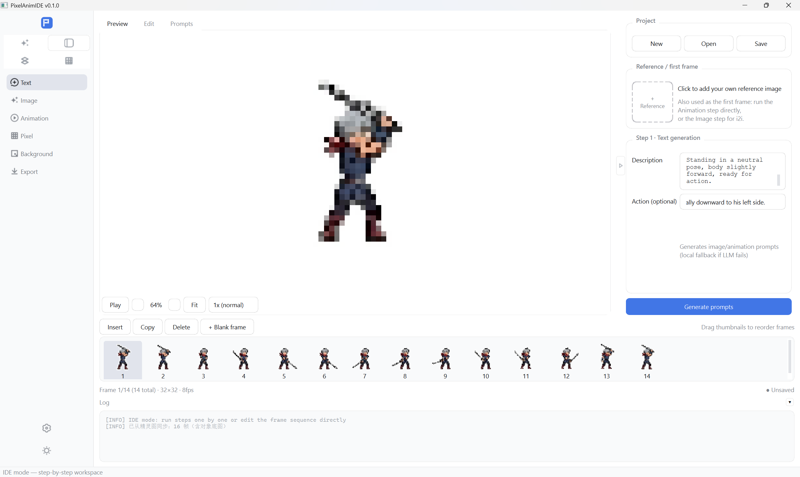

# PixelAnimIDE

> **像素动画 IDE** · 中文版：[README_CN.md](README_CN.md) · UI 语言可在 设置 → 常规 → 语言 切换

[](https://github.com/xf785/PixelAnimIDE-IDE/actions/workflows/ci.yml)
[](https://github.com/xf785/PixelAnimIDE-IDE/releases)
[](LICENSE)
[]()
[]()

**One-click pixel animation IDE** — a free, open-source desktop tool that turns **text or your own image into crisp, game-ready pixel assets**:

> text → image generation → video animation → **strict pixelization** → background removal → GIF / APNG / PNG sequences / sprite sheets

Built for indie game devs, pixel artists, and AI tinkerers who want *real* pixel art — sharp edges and exact colors — not blurry downscaled images.

<p align="center">
  
</p>

## ✨ Highlights

- 🚀 **One-click Solo pipeline** — text → animation → pixel art, fully automated. Works offline with deterministic mock APIs, no keys required.
- 🎯 **Perfect-pixel engine** — frame-0 grid detection (FFT + purity/boundary search) + exact per-cell sampling on every frame, so colors stay precise and edges stay hard.
- 🎬 **IDE step workspace** — 6 independently runnable steps, step-aware parameter panel, frame timeline, live keying preview.
- 🧩 **Sprite sheets** — one img2img call produces a whole i×j grid sheet, auto-cropped, loop-closed and keyed.
- 🖌️ **Krita-style pixel editor** — color-family palette with right-click whole-family replace, right-click color wheel, selection & floating layers, onion skin, palette lock.
- 🖼️ **Standalone pixel board** — 4th mode with resolution settings, two-way IDE sync, and video-first-frame handoff (NEAREST upscale, never blurry).
- 🌐 **Bilingual + scalable UI** — Chinese / English, UI scale 0.8×–1.5×, self-drawn DSH-style icons.
- 🔌 **Provider-agnostic** — one-click presets for DeepSeek, Kimi, Zhipu, SiliconFlow, Ark, DashScope, Hunyuan, Ollama, gpt.ge, Kling… plus proxy & SSL options.
- 📦 **Open source** — MIT license, CI on GitHub Actions (Win + Linux), Windows releases via PyInstaller.

## 🚀 Quick Start

```bash
# 1. Create a virtual environment and install dependencies (Windows)
python -m venv .venv
.\.venv\Scripts\activate
pip install -r requirements.txt

# 2. Launch the GUI
python main.py

# 3. No API keys? Run the full pipeline with deterministic mock APIs
python main.py --demo
```

> Demo mode writes `demo_output/` containing a GIF, PNG frame sequence, metadata and project files.

## 🌐 UI Language

The UI supports **Chinese / English** — switch in **Settings → General → Language** (restart to apply). Untranslated strings fall back to Chinese; the translation table lives in `ui/i18n.py` (extend it to cover more).

## 🕹️ The Four Modes

### Solo Mode — one-click pipeline

1. In **Settings**, configure the three APIs (LLM / Image / Video), or tick **"Use mock API (no key)"** for offline use.
2. Type a description on the **Parameters** tab (e.g. *"an orange kitten holding a sword, chibi, side view"*), pick an action & output options; optionally upload a **reference image** card for **image-to-image (i2i)**.
3. Hit **Start generating**: prompts → first frame (i2i when a reference exists) → animation → pixelization → background removal → export.
4. The right-side preview supports **playback speed** (0.5x/1x/1.5x/2x/3x).
5. **Sync to IDE** imports the first frame + final frame sequence into the IDE workspace for fine editing.

### IDE Mode — step-by-step control

The top-left **2×2 icon switch** (Solo ✦ / IDE ⊞ / Sprites ▤ / Pixel ▦) opens **IDE** (left rail expands). The Solo pipeline is split into **6 independently runnable steps** — text → image → animation → pixelize → background removal → export:

- The **right parameter panel follows the selected step** and is **collapsed by default** (one chevron to expand); the bottom log box can be collapsed/expanded.
- **No full pipeline needed**: import your own image as **reference / first frame**, then jump straight to the Animation step (image as first frame) or the Image step (i2i).
- **Prompts** tab for hand-editing; **Preview** plays the animation (cursor-focus wheel zoom, crisp NEAREST sampling, speed control); **Edit** edits pixels.
- Bottom **timeline**: click to select, drag to reorder, insert/duplicate/delete/append frames.
- **Pixel editor**: canvas fills the panel; controls live in a right icon column (left-click = tool, right-click = second-level options) and a collapsible bottom color-family bar. Four background modes (checker/white/black/green), grid toggle, Ctrl+wheel cursor-focus zoom, Ctrl+left-drag pan, **right-drag region fill**.
- **Selection & layers**: rect / lasso / Ctrl+click multi-select → **Ctrl+C copy → Ctrl+V paste as a semi-transparent floating layer** → **Ctrl+right-drag move (any tool)** → **Ctrl+M merge** (Esc cancels).
- **Color families + color wheel**: colors auto-cluster into families (White / Red / Light-red…); right-click a family to replace it wholesale **preserving the inner gradient**; right-click-and-hold on the canvas opens a **Krita-style color wheel** (hue ring + S/V square + recent colors).
- **Save** writes frames + prompts + params (`frames/` + `ide_project.json`); **Open** restores.

### Sprite Mode — grid sprite sheets (text-only, no video)

1. Enter a description, optional action loop, **frame count**, **grid i×j** (e.g. 4×4 = 16), cell size and max colors.
2. **Generate sprite sheet**: text → **base image** → one img2img call producing the **whole i×j grid sheet** → algorithmic **crop into frames** (row-major, auto-inset removes AI cell border lines) → **loop close** (last = first) → one-click **keying** → export GIF / PNG sequence / keyed sheet + metadata.
3. Live preview tabs: base image / sprite sheet / frame sequence.
4. **Sync to IDE** imports the base image (as first frame) + cropped frames for per-frame pixel polish.

### Pixel Mode — standalone pixel board

A dedicated pixel canvas (reusing the full editor):

- **New canvas**: preset (16–512) or custom W×H + background (transparent/white/black).
- **Sync from IDE** pulls the current IDE frame for fine pixel editing; **Sync to IDE** sends the canvas as **first frame + i2i reference**.
- **Use as video first frame** hands it to Solo for image-to-video — if below the API minimum size it is **NEAREST-upscaled** (hard edges, no blur) via `video_image_min_side` (default 256) paired with `video_image_max_side` (default 512).
- **Export PNG**.

## 📋 Feature Table

| Module | Description |
|--------|-------------|
| API config management | Multiple configs per API type: CRUD, default, connectivity test, JSON import/export |
| Encrypted keys | `cryptography` Fernet, no plaintext on disk |
| LLM / Image / Video APIs | OpenAI-compatible httpx wrapper, unified timeout/retry/error handling, configurable endpoints, video polling task model; **fully custom mode** (JSON request-body templates with `$prompt/$model/$image/$size/$frames`… placeholders, custom response field paths, request method, extra headers, multi-line editors) — connect any non-OpenAI-compatible service |
| Solo workflow | Full auto pipeline + progress/log/cancel; local fallback prompts when the LLM fails |
| Perfect pixelization | Frame-0 grid detection (FFT + purity/boundary candidate search), exact per-cell sampling on all frames, frequency-based palette; non-pixel art auto-skipped; graceful fallback |
| Pixel-style image gen | Pixel keywords force a preset pixel resolution (long edge max(pixel_size, 256)) |
| i2i reference image | Solo & IDE text-to-image support a reference card (Doubao/Jimeng style); `image_field` / `image_mode` (data URI vs multipart, gpt.ge auto); unsupported sizes auto-retry at 512/768/1024/1536 |
| IDE reference / first frame | Import your own image and jump straight to Animation (as first frame) or Image (i2i) |
| LLM auto-tuning | LLM suggests `frame_count`/`fps` from the action; applied only when the user hasn't customized |
| Loop close | Extraction keeps first+last frames with **content-aware middle sampling** (greedy farthest-point — skips static holds, keeps the most distinct poses); consecutive identical frames auto-deduped; last frame forced = first; `last_frame` passes the first frame as the last to the API |
| Playback speed | 0.5x–3x, calibrated to actual video duration |
| Silent video | Audio stripped with ffmpeg `-c copy` (no re-encode) |
| Background stability | Animation prompts force a stable pure-white background; `last_frame` stabilizes the endpoints |
| Subject integrity | Prompts force the subject fully visible, centered, with clear margins — never cropped or touching edges |
| Forced solid background | Prompt + adaptive background normalization (pale subject → black, else white); precise mask keying |
| Background removal | Color key + tolerance + shrink (removes white fringe) + feather; **tiered tolerance modes** (inspired by FrameRonin): `contiguous` (only border-connected bg removed — protects interior white pixels), `hybrid` (big tolerance on connected bg, small tolerance inside the subject), `adaptive` (large disconnected regions get a tolerance bonus); IDE **live keying preview** dialog applied to all frames |
| Export | GIF (transparent), **APNG**, PNG sequence, **sprite sheet + FrameRonin-style index JSON** (per-frame x/y/w/h + timestamps, spacing/orientation/auto-square layout), JSON metadata, project files |
| Dual-resolution export | Pixel-art output exports both the native grid resolution and the user preset, sharing one palette (identical colors) |
| IDE workspace | Step nav / center preview+edit+prompts / right step-aware params (collapsible) / bottom timeline + collapsible log |
| Timeline | Frame thumbnails, click-select, drag-reorder, insert/duplicate/delete/append blank frame |
| Pixel editor | Pencil/Eraser/Eyedropper/Fill/Select, undo/redo (Ctrl+Z / Ctrl+Shift+Z), integer zoom + grid + checkerboard, cursor-focus wheel zoom, Ctrl+left pan, **local import/export images**, background modes, right icon column + collapsible palette bar |
| Tool icons | Self-drawn 16px flat-line icons (DSH style, recolorable); left-click = tool, right-click = second-level options (brush size / selection mode / fill / background) |
| Brush size | 1–8 px square brushes for pencil/eraser |
| Selection & floating layer | Rect / lasso / Ctrl+click multi-select with a **screen-space blue dashed border** (1px cosmetic pen, crisp at any zoom); Ctrl+C → Ctrl+V semi-transparent floating layer → Ctrl+right-drag move (any tool, auto-lifts a selection) → Ctrl+M merge (alpha, undoable) |
| Region fill | Right-drag a rectangle and release to fill it with the current color (undoable); quick right-click/hold still opens the color wheel |
| Color-family palette | Colors clustered by RGB distance (White / Red / Light-red…); top 6 families + "…" dialog (compact swatch grid, names on hover); right-click replaces a whole family preserving the inner gradient |
| Right-click color wheel | Krita-style: hue ring + saturation/value square + recent-color bar (last 10), live preview, release commits, Esc cancels (snaps when palette locked) |
| Preview zoom | 0.2x–8x zoom/fit with cursor-focus wheel zoom, percentage shown; NEAREST sampling keeps pixels crisp |
| Preview speed | Playback speed in Solo **and** IDE preview (0.5x/1x/1.5x/2x/3x), applies live |
| Onion skin | Semi-transparent overlay of adjacent frames while editing |
| Palette lock | Drawing/filling snaps to the nearest locked color; one-click extract palette from the current frame |
| Project persistence | IDE workspace save/load (`frames/` + `ide_project.json`) |
| UI scale | Settings → General → UI scale (0.8×/1.0×/1.25×/1.5×) — fonts **and** all fixed UI sizes scale together |
| Custom shortcuts | Settings → **Shortcuts** with **two-level navigation in the left category list** (click to open the form, click the item again to expand the Solo/IDE/Sprites/Pixel submenu right below it, ▸/▾ arrow, current mode highlighted; click again to collapse while the form stays): two-level dropdown (category → action), press-to-record, conflict warning, reset per-action / all; each mode has its own key set (IDE: play/pause, fit, timeline insert/duplicate/delete; Solo/Sprites: play/pause, fit; Pixel editor: undo/redo/copy/paste/merge, selection, zoom, tools) — applies immediately |
| Dark mode switch | Settings → General: **iOS-style toggle switch** (pill track + white knob, click to toggle, 150ms eased slide, #007AFF on / #D0D0D0 off, dark-theme variant) replaces the theme dropdown |
| Solo → IDE sync | First frame + final frame sequence imported into the IDE workspace in one click |
| Sprite generation | Text-only grid sheet with **Auto / Manual toggle in the left rail** (slide left = auto, right = manual; manual: 7 steps, each step can be rerun or continued): **high-res base image (1024×1024) used as-is for i2i** → one-call i×j sheet (strong built-in prompt: uniform cells, first/last pose identical, character never mutates) → crop (row-major, auto `cell_inset` removes AI black borders) → **Perfect-Pixel dual resolution** (native grid size + user size, NEAREST upscale, shared palette) → loop close → keying; exports **both** resolutions in three formats: PNG sequence / **algorithmically re-composited grid sheet** (+ index JSON) / GIF |
| Sprite → IDE sync | Base image (as first frame) + cropped frames imported for pixel polish, then IDE export |
| Standalone pixel board | 4th mode: resolution settings (**collapsible settings panel** for a bigger canvas, **draggable splitter** to resize the panel), IDE sync both ways, video-first-frame handoff, PNG export |
| i18n | Chinese/English UI (Settings → General → Language); `ui/i18n.py` translation table |
| Token savings | First-frame images ≤ `video_image_max_side` (512) before upload; LLM `max_tokens` 800; image size prefers the API default; minimal GET polling |

## 🔌 Provider Adaptation

Provider differences are configured in **Settings** — no code changes:

- **Presets**: one-click fill Base URL / model / adapter params (DeepSeek, Kimi, Zhipu, SiliconFlow, Ark, DashScope, Hunyuan, Ollama, gpt.ge, Kling…). With an API key set, **Query models** lists available models.
- **LLM / Image** (OpenAI-compatible): provider root URL; if the path differs (`404 Invalid URL`), set the **endpoint path** or a full URL override. **i2i upload mode**: data URI by default; gpt.ge requires **multipart file upload** (`image_mode=multipart`, auto-enabled for `api.gpt.ge`). **Size fallback**: rejected sizes auto-retry at 512/768/1024/1536.
- **Video**: `generic` (OpenAI-compatible polling), **Doubao Seedance (Ark)**, **gpt.ge V-API** presets; request-body templates with `$model/$prompt/$image/$frames/$fps/$duration` placeholders; `submit_url`/`poll_url` support `{base}`/`{id}`; polling fields configurable; **`last_frame`** sends the first frame as the last for first/last consistency.
- **Proxy / SSL**: per-API advanced options — proxy URL for blocked networks, `verify_ssl` toggle; network errors auto-retry with troubleshooting hints.

## 📁 Project Layout

```
PixelAnimIDE/
├── main.py                 # entry (GUI + --demo)
├── requirements.txt
├── config/                 # global + API config (encrypted keys)
├── core/
│   ├── api/                # BaseAPI / LLM / Image / Video / Mock / factory
│   ├── workflow/           # Solo / IDE / sprite workflows
│   ├── processing/         # pixelizer / background / frame_utils / prompt_utils
│   ├── editing/            # pixel canvas model (draw / undo / selection / paste)
│   └── storage/            # keyring (encrypted), project files
├── ui/                     # main window, pages, widgets, QSS + DSH-style icons
│   ├── i18n.py             # zh/en translation table (tr())
│   ├── pages/              # solo / ide / sprite / pixel
│   └── widgets/            # image_viewer / pixel_editor / color_wheel / timeline / api_config_widget / reference_box
├── assets/prompts.json     # preset action prompt library (extensible)
├── docs/screenshots/       # UI screenshots used in the docs
└── tests/                  # unit + e2e + GUI smoke tests
```

## ✅ Testing

```bash
.\.venv\Scripts\python.exe -m pytest -v
```

Covers: pixelization, background removal, frame utils (real mp4 extraction), keyring, config management, API clients (httpx MockTransport), mock clients, Solo e2e, IDE workflow, canvas editing, i18n, GUI smoke.

## 🗺️ Roadmap

Phase 1–4 shipped (MVP / IDE / sprite workflow / standalone pixel board / i18n / CI / release **v0.1.0**). Up next:

- **Map tiles & tile-map editor** (tileset generation + a 5th tile-map mode)
- **Solo performance & quality** (caching, multi-candidate generation, quality baselines)
- **Pixel editor & sprite refinements** (more tools, real layer stack, in-page sprite editing)
- **Continuous polish** (packaging, auto-update, docs, community)

See [**ROADMAP.md**](ROADMAP.md) (English) / [**ROADMAP_CN.md**](ROADMAP_CN.md) (中文) for milestones M1–M4.

## 📄 Notes & License

- Runtime config & keys live in the user data dir (Windows: `%APPDATA%\PixelAnimIDE\`).
- Video providers differ; adapt via config (endpoints, polling, status fields) — see `core/api/video_api.py`.
- User assets and outputs are stored locally by default.
- **Open-source / commercial compliance**: nav icons come from DeepSeek Harness (MIT License, Copyright (c) 2026 DeepSeek) — keep the attribution, see [`THIRD_PARTY_NOTICES.md`](THIRD_PARTY_NOTICES.md). This project is not affiliated with DeepSeek.
- Licensed under the [MIT License](LICENSE). Copyright (c) 2026 StrFaith.
