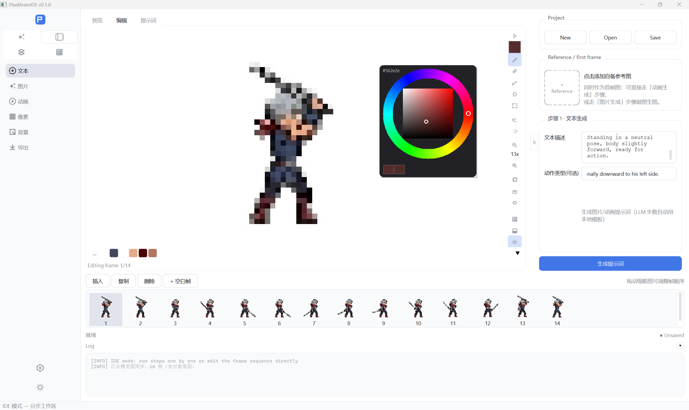

# PixelAnimIDE

> **Pixel Animation IDE** · English: [README.md](README.md) · UI 语言可在 设置 → 常规 → 语言 切换（中/英）

[](https://github.com/xf785/PixelAnimIDE-IDE/actions/workflows/ci.yml)
[](https://github.com/xf785/PixelAnimIDE-IDE/releases)
[](LICENSE)
[]()
[]()

**像素动画 IDE** —— 一款免费开源的桌面工具，把**文本或自备图片一键变成像素级游戏素材**：

> 文本描述 → 图片生成 → 动画生成 → **严格像素化** → 背景去除 → GIF / APNG / PNG 序列帧 / 精灵图

为独立游戏开发者、像素画师与 AI 玩家打造：要的是**真正的像素画**——边缘锐利、颜色精确——而不是模糊的缩小图。

<p align="center">
  
</p>

## ✨ 亮点

- 🚀 **Solo 一键流程**——文本 → 动画 → 像素画全自动；离线可用确定性模拟 API，无需任何密钥。
- 🎯 **完美像素引擎**——首帧定网格（FFT + 纯度/边界搜索）+ 全部帧逐格精确采样，颜色精确还原、边缘不发糊。
- 🎬 **IDE 分步工作区**——6 个可独立执行的步骤、随步骤切换的参数面板、帧时间轴、实时抠图预览。
- 🧩 **精灵图**——一次图生图调用生成整张 i×j 网格精灵图，自动裁切、首尾闭合、一键抠图。
- 🖌️ **Krita 风格像素编辑器**——色族调色板（右键整族替换保留渐变）、右键取色圆盘、选区与浮动图层、洋葱皮、调色板锁定。
- 🖼️ **独立像素板块**——第 4 个模式：分辨率设置、与 IDE 双向同步、用作图生视频首帧（最近邻放大，绝不模糊）。
- 🌐 **中英双语 + UI 缩放**——界面语言即时切换，0.8×–1.5× 全局缩放，自绘 DSH 风格图标。
- 🔌 **服务商无关**——DeepSeek / Kimi / 智谱 / 硅基流动 / 火山方舟 / 通义 / 混元 / Ollama / gpt.ge / 可灵… 一键预设，含代理与 SSL 选项。
- 📦 **开源**——MIT 协议、GitHub Actions CI（Win + Linux）、PyInstaller 发布 Windows 版。

## 🚀 快速开始

```bash
# 1. 创建虚拟环境并安装依赖（Windows）
python -m venv .venv
.\.venv\Scripts\activate
pip install -r requirements.txt

# 2. 启动 GUI
python main.py

# 3. 无 API 密钥也能跑通全流程（演示模式，使用确定性模拟 API）
python main.py --demo
```

> 演示模式会生成 `demo_output/`，内含 GIF、PNG 序列帧、元数据与项目文件。

## 🌐 界面语言

界面支持**中文 / 英文**——在 设置 → 常规 → 语言 切换（重启后生效）。未翻译文案回退中文；翻译表在 `ui/i18n.py`（可自行扩充）。

## 🕹️ 四大模式

### Solo 模式 —— 一键生成

1. 在「设置」中配置三种 API（通用文本 / 图片生成 / 图转视频），或勾选「使用模拟 API（无需密钥）」离线体验。
2. 在「Solo 模式」左侧「参数」页签输入文本描述（如「一只拿着剑的橙色小猫，Q 版，侧身站立」），选择动作类型与输出参数；可选点「参考图」小卡片上传自备图片做**图生图**。
3. 点击「开始生成」：提示词生成 → 首帧图片（含参考图时走图生图）→ 动画 → 像素化 → 去背景 → 导出。
4. 右侧预览支持**播放倍速**（0.5x/1x/1.5x/2x/3x）。
5. 点「同步到 IDE」把本次生成的**首帧图**与**最终帧序列**导入 IDE 工作区继续精细编辑。

### IDE 模式 —— 分步精控

左上角 **2×2 图标模式开关**（Solo ✦ / IDE ⊞ / 精灵图 ▤ / 像素 ▦，自绘开源风格图标，直接绘制在侧栏上无背景框）切到 **IDE**（左侧导航栏展开）。Solo 流程被拆成 **6 个可独立执行的步骤**——文本 → 图片 → 动画 → 像素化 → 去背景 → 导出：

- **右侧参数面板随左侧步骤同步切换**，且**默认收起**（一个三角钮展开）；底部日志框可收起/展开。
- **无需全链路**：导入自备图片作为「参考图 / 首帧图」后，可直接走「动画生成」（图片作为首帧），或走「图片生成」做**图生图**。
- 「提示词」页签可手动编辑；「预览」播放动画（滚轮以光标为焦点缩放、最近邻采样边缘锐利、倍速控制）；「编辑」修改像素。
- 底部**时间轴**：点击选中、拖动排序、插入/复制/删除/追加空白帧。
- **像素编辑器**：画布占满主体，控件收敛到右侧图标列（左键选工具、右键二级选项）与可折叠的底部色族调色板条；**背景四档**（灰黑网格/纯白/纯黑/纯绿）、网格显示/隐藏、Ctrl+滚轮焦点缩放、Ctrl+左键平移、**右键拖拽框选填充**。
- **选区与图层**：框选 / 套索 / Ctrl+点选多像素 → **Ctrl+C 复制为浮动图层** → **Ctrl+右键拖拽移动（任意工具下）** → **Ctrl+M 合并**（Esc 取消）。
- **色族调色板 + 取色圆盘**：相近颜色自动聚类（白色族 / 红色族 / 淡红色族…），**右键整族替换并保留族内渐变**；在画布上**按住右键**弹出 Krita 风格取色圆盘（色相环 + 饱和度/明度方块 + 最近使用色）。
- 「保存」写入帧序列 + 提示词 + 参数（`frames/` + `ide_project.json`），「打开」恢复。

### 精灵图模式 —— 网格精灵图（仅文生图，不走视频）

1. 输入文本描述 + 可选动作（每帧动作循环）、**帧数**、**网格 i×j**（如 4×4=16 格）、单格尺寸、颜色数。
2. 「生成精灵图」：文生**对象底图** → 以底图为参考图**一次调用**生成**一整张 i×j 网格精灵图** → **算法裁切**为帧序列（行优先，每格自动内缩去 AI 黑框）→ **首尾帧对齐**（末帧=首帧，循环无缝）→ **一键抠图** → 导出 GIF / PNG 序列 / 抠图后精灵图 + 元数据。
3. 实时预览：对象底图 / 精灵图 / 帧序列三个页签。
4. 点「同步到 IDE」把**对象底图**（作为首帧图）与**裁切后的帧序列**导入 IDE 工作区逐帧精修。

### 像素模式 —— 独立像素画板

独立像素画布（复用完整编辑能力）：

- **新建画布**：预设分辨率（16–512）或自定义宽×高 + 背景（透明/白/黑）。
- **从 IDE 同步**拉取当前帧精细编辑；**同步到 IDE** 把画布图作为**首帧 + 图生图参考**。
- **用作图生视频首帧**：发给 Solo 一键走图生视频——低于 API 最低要求时自动**最近邻放大**（像素画保持硬边不模糊），由 `video_image_min_side`（默认 256 长边）与 `video_image_max_side`（默认 512）控制。
- **导出 PNG** 存盘。

## 📋 功能一览

| 模块 | 说明 |
|------|------|
| API 配置管理 | 三类 API 多套配置增删改查、默认切换、连通性测试、JSON 导入导出 |
| API 密钥加密 | `cryptography` Fernet 加密落盘，磁盘不存明文 |
| LLM / 生图 / 图转视频 API | OpenAI 兼容协议封装（httpx），统一超时/重试/错误处理；端点路径可配置；视频支持轮询式任务模型 |
| Solo 工作流 | 全自动链路 + 进度/日志/取消，LLM 失败自动降级本地模板 |
| 完美像素化 | 首帧定网格（FFT + 纯度/边界候选搜索），**全部帧按同一网格逐格精确采样**；频度调色板；非像素风自动跳过；失败优雅回退 |
| 像素风生图 | 提示词含像素关键字时，生图尺寸强制预设像素分辨率（长边 max(pixel_size,256)） |
| 图生图（参考图） | Solo 与 IDE 均支持参考图小卡片（豆包/即梦风格）；`image_field` / `image_mode` 可配（data URI 或 multipart，gpt.ge 自动启用）；尺寸被拒自动按 512/768/1024/1536 回退重试 |
| IDE 参考图/首帧图 | 导入自备图即可直接走「动画生成」（作为首帧）或「图片生成」（图生图） |
| LLM 自动调参 | LLM 按动作推荐 `frame_count`/`fps`；用户未自定义时才自动套用 |
| 循环闭合 | 抽帧**保留首帧与尾帧、中间均匀采样**；「首尾帧一致」强制末帧=首帧；`last_frame` 把首帧同时作为尾帧传给 API |
| 播放倍速 | 0.5x–3x，先按视频实际时长校准原速再乘倍速 |
| 无声视频 | ffmpeg `-c copy` 去音轨（不重编码视频） |
| 背景稳定 | 动画提示词强制「背景保持纯白且逐帧不变」；`last_frame` 进一步稳定首尾背景 |
| 主体完整性 | 提示词强制「主体完整居中、与画面边缘留白、不裁切不贴边」 |
| 强制纯色背景 | 提示词 + **自适应背景归一化**（浅色主体自动刷纯黑，否则纯白）；精确掩膜抠图 |
| 背景去除 | 颜色键 + 容差 + **内缩（去白边/白晕）** + 羽化；IDE 有**实时抠图预览**弹窗（容差/内缩/羽化）一键应用到全部帧 |
| 导出 | GIF（含透明）、**APNG**、PNG 序列帧、**雪碧图**、JSON 元数据、项目文件 |
| 双分辨率保留 | 像素风产物同时导出**原生网格分辨率**与**用户预设分辨率**，两版共享同一调色板（颜色完全一致） |
| IDE 分步工作区 | 左步骤导航 / 中预览+编辑+提示词 / 右参数（随步骤切换、默认收起）/ 底部时间轴 + 可折叠日志 |
| 时间轴 | 帧缩略图、点击选中、拖动排序、插入/复制/删除/追加空白帧 |
| 像素编辑画布 | 铅笔/橡皮/取色/填充/选择，撤销重做（Ctrl+Z / Ctrl+Shift+Z），整数倍缩放 + 网格 + 透明棋盘背景，滚轮焦点缩放，Ctrl+左键平移，**本地导入/导出图片**，背景四档 + 网格开关，右侧图标列 + 可折叠调色板条 |
| 工具图标素材 | 全部工具为**自绘 16px 扁平线条图标**（DSH 风格，主题可换色）；左键选工具、右键二级选项（笔刷大小/选择方式/填充/背景档） |
| 笔刷大小 | 铅笔/橡皮支持 1–8px 方形笔刷 |
| 选择与浮动图层 | 框选/套索/Ctrl+点选多像素，**屏幕空间蓝色细虚线框**（1px cosmetic 笔，任意缩放清晰）；Ctrl+C → Ctrl+V 半透明浮动图层 → Ctrl+右键拖拽移动（任意工具，自动提起选区）→ Ctrl+M 合并（alpha 合成，可撤销） |
| 框选区域填充 | 右键拖拽框选矩形，松开即用当前颜色整块填充（可撤销）；右键快速点击/按住仍为取色圆盘 |
| 色族调色板 | 颜色按 RGB 距离自动聚类（白色族/红色族/淡红色族…）；顶部前 6 个高频色族 +「…」（紧凑色块网格，悬停显示族名）；右键整族替换并保留族内渐变 |
| 右键取色圆盘 | Krita 式：色相环 + 饱和度/明度方块 + 最近使用色条（最近 10 个），移动实时预览、松开提交（锁色时自动吸附）、Esc 取消 |
| 预览缩放 | 0.2x–8x 放大/缩小/适应，滚轮以鼠标位置为焦点，百分比实时显示；最近邻采样边缘锐利 |
| 预览倍速 | Solo 与 **IDE 预览**均支持 0.5x/1x/1.5x/2x/3x，播放中调整即时生效 |
| 洋葱皮 | 编辑时半透明叠加相邻帧，便于对齐动画 |
| 调色板锁定 | 锁定后绘制/填充自动吸附最近锁定色；一键从当前帧提取调色板 |
| 项目持久化 | IDE 工作区保存/加载（`frames/` + `ide_project.json`） |
| 界面布局比例 | 0.8×/1.0×/1.25×/1.5×：**文字与全部 UI 尺寸同步缩放**（字体/侧栏/模式开关/编辑器/参数面板/表单） |
| Solo→IDE 同步 | 首帧图与最终帧序列一键导入 IDE 工作区继续编辑 |
| 精灵图生成 | 仅文生图：底图 → 一次调用生成整张 i×j 网格（强提示词：等大格/首尾格姿势一致/角色逐格不突变）→ 裁切（行优先，自动 `cell_inset` 去黑框）→ 首尾对齐 → 抠图；帧统一缩放至单格尺寸（NEAREST） |
| 精灵图→IDE 同步 | 对象底图（作为首帧图）+ 裁切帧序列一键导入 IDE 精修后走导出 |
| 独立像素板块 | 第 4 个模式：分辨率设置、与 IDE 双向同步、用作图生视频首帧、导出 PNG |
| 中英 i18n | 设置 → 常规 → 语言；`ui/i18n.py` 翻译表 |
| 省 token 优化 | 首帧图上传前缩放至 ≤512 长边；LLM `max_tokens` 800；生图优先默认尺寸；轮询用最小 GET |

## 🔌 服务商适配

不同 AI 服务商的接口差异通过「设置」页配置项适配，无需改代码：

- **服务商预设（一键填充）**：Base URL / 模型 / 适配参数自动填好（DeepSeek、Kimi、智谱、硅基流动、火山方舟、通义、腾讯混元、Ollama、gpt.ge、可灵 Kling 等）；填了 Key 后可用「查询模型」列出可用模型。
- **LLM / 生图**（OpenAI 兼容）：填服务商根地址；端点路径不同（报 `404 Invalid URL`）时填「端点路径」或完整 URL 覆盖。**图生图上传方式**：默认 data URI；gpt.ge 需 **multipart 文件上传**（`image_mode=multipart`，`api.gpt.ge` 域名自动启用）。**尺寸自动回退**：被拒尺寸自动按 512/768/1024/1536 重试。
- **图转视频**：`通用`（OpenAI 兼容轮询）、**Doubao Seedance（火山方舟）**、**gpt.ge V-API** 预设；「请求体模板」支持 `$model/$prompt/$image/$frames/$fps/$duration` 占位符；提交/轮询端点支持 `{base}`/`{id}`；轮询字段可配；**`last_frame`** 把首帧同时作为尾帧传入，从源头保证首尾一致。
- **代理 / SSL**：每类 API 高级选项——被拦截/报 TLS 错误时填本地代理地址；`verify_ssl` 可关；网络错误自动重试并附排查提示。

## 📁 目录结构

```
PixelAnimIDE/
├── main.py                 # 程序入口（GUI + --demo）
├── requirements.txt
├── config/                 # 全局配置、API 配置管理（密钥加密存储）
├── core/
│   ├── api/                # BaseAPI / LLM / Image / Video / Mock / 工厂
│   ├── workflow/           # Solo / IDE / 精灵图工作流
│   ├── processing/         # pixelizer / background / frame_utils / prompt_utils
│   ├── editing/            # 像素画布数据模型（绘制/撤销/选择/粘贴）
│   └── storage/            # keyring（加密）、project（项目文件）
├── ui/                     # 主窗口、页面、组件、QSS 主题 + DSH 风格图标
│   ├── i18n.py             # 中英翻译表（tr()）
│   ├── pages/              # solo_page / ide_page / sprite_page / pixel_page
│   └── widgets/            # image_viewer / pixel_editor / color_wheel / timeline / api_config_widget / reference_box
├── assets/prompts.json     # 预设动作提示词库（可扩展）
├── docs/screenshots/       # 文档用 UI 截图
└── tests/                  # 单元测试 + 端到端测试 + GUI 冒烟测试
```

## ✅ 测试

```bash
.\.venv\Scripts\python.exe -m pytest -v
```

覆盖：像素化算法、背景去除、帧工具（含真实 mp4 拆帧）、密钥加密、配置管理、三类 API 客户端（httpx MockTransport）、模拟客户端、Solo 全流程端到端、IDE 分步工作流、像素画布编辑、GUI 冒烟。

## 🗺️ 开发规划

阶段 1–4 已完成（MVP / IDE / 精灵图 / 独立像素板块 / i18n / CI / 发布 **v0.1.0**）。接下来：

- **地图瓦片与瓦片地图编辑**（瓦片集生成 + 第 5 个瓦片地图模式）
- **Solo 性能与生成质量**（缓存、多候选生成、质量回归基准）
- **像素编辑器与精灵图精进**（更多工具、真实图层栈、精灵图页内逐帧编辑）
- **持续打磨**（打包、自动更新、文档、社区）

详见 [**ROADMAP_CN.md**](ROADMAP_CN.md)（中文）/ [**ROADMAP.md**](ROADMAP.md)（English）的 M1–M4 里程碑。

## 📄 说明与许可

- 运行期配置与密钥存放在用户数据目录（Windows: `%APPDATA%\PixelAnimIDE\`）。
- 生图/视频 API 因服务商差异较大，视频 API 支持通过配置项适配（端点、轮询、状态字段等），详见 `core/api/video_api.py`。
- 用户素材与生成结果默认全部保存在本地。
- **开源/商用合规**：导航图标来自 DeepSeek Harness（MIT License, Copyright (c) 2026 DeepSeek），使用须保留版权声明，详见 [`THIRD_PARTY_NOTICES.md`](THIRD_PARTY_NOTICES.md)。本项目与 DeepSeek 无隶属关系。
- 遵循 [MIT License](LICENSE)。Copyright (c) 2026 StrFaith。
